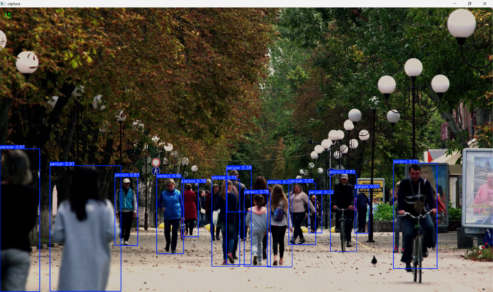

# Reconhecimento de Pessoas usando YOLO

Programa que identifica pessoas em um vídeo usando YOLO e exibe a
quantidade de pessoas detectadas em uma janela.




## Requisitos

- Python 3.14
- Um arquivo de vídeo chamado `video.mp4` na raiz do projeto
- O modelo `yolov8n.pt` na raiz do projeto

## Instalação

No terminal, dentro da pasta do projeto, instale as dependências:

```bash
python -m pip install ultralytics opencv-python
```

Ao executar o programa, uma janela será aberta e o reconhecimento começará.
Pressione `q` para fechar a janela.